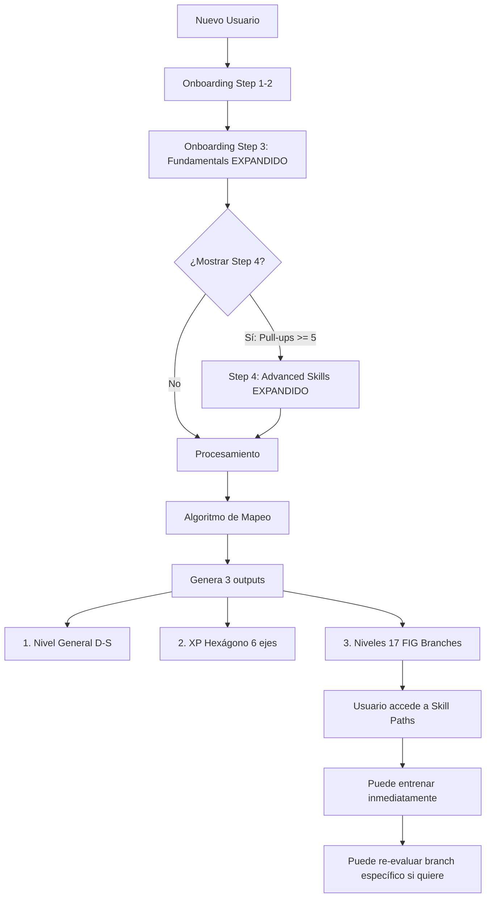

# Propuesta: Assessment Unificado Inteligente

## Objetivo
Crear un cuestionario de entrada que en UNA SOLA PASADA:
1. Evalúe los 6 ejes del hexágono de manera equilibrada
2. Asigne niveles iniciales a los 17 FIG Skill Branches
3. Sincronice con las rutinas de entrenamiento
4. Mantenga la experiencia corta (5-7 minutos máximo)

---

## Estructura Propuesta

### **STEP 1: Demographics & Goals** ✅ (Ya existe, mantener)
- Age, Height, Weight, Gender
- Goals (hasta 3)

### **STEP 2: Equipment** ✅ (Ya existe, mantener)
- Floor, Pull-up Bar, Rings, Parallel Bars, Resistance Bands

### **STEP 3: Fundamental Tests** ⚠️ (EXPANDIR)

#### Sección A: PUSH (strength)
- ✅ Push-ups count
- ✅ Dips count

#### Sección B: PULL (strength)
- ✅ Pull-ups count
- ✅ Dead hang time

#### Sección C: CORE (core)
- ✅ Plank time
- ✅ Hollow body hold
- 🆕 **NUEVO**: L-sit attempt: "Can you lift your legs off the ground in L-sit position?" (no/tuck/full)

#### Sección D: LEGS (endurance)
- ✅ Bodyweight squats
- ✅ Pistol squat ability

#### 🆕 Sección E: MOBILITY (mobility) - NUEVA
```typescript
mobility: {
  shoulderMobility: 'poor' | 'average' | 'good' | 'excellent',
  // "Can you touch your hands behind your back?"

  wristFlexibility: 'poor' | 'average' | 'good',
  // "Can you place your palms flat on the floor with fingers pointing backwards?"

  bridge: 'no' | 'partial' | 'full',
  // "Can you do a bridge (back arch)?"
}
```

#### 🆕 Sección F: ENDURANCE (endurance) - NUEVA
```typescript
endurance: {
  continuousPushUps: number, // Ya existe como pushUps

  maxRepsIn1Min: 'less_than_10' | '10-20' | '20-30' | '30+',
  // "How many push-ups can you do in 1 minute (no rest)?"

  circuitEndurance: 'cannot_complete' | 'with_long_breaks' | 'with_short_breaks' | 'no_breaks',
  // "Can you complete: 10 push-ups + 5 pull-ups + 15 squats (3 rounds)?"
}
```

### **STEP 4: Advanced Skills** ⚠️ (REORGANIZAR)

En lugar de preguntar por 8 skills diferentes, agrupar por categorías y usar las respuestas para INFERIR nivel en los 17 branches:

#### 🎯 Balance Skills
```typescript
balance: {
  handstand: 'no' | 'wall_5-30s' | 'wall_30s+' | 'free_5-15s' | 'free_15s+',
  handstandPushUp: 'no' | 'partial_wall' | 'full_wall_1-5' | 'full_wall_5+' | 'freestanding',

  // 🆕 NUEVO: Crow pose (mide balance básico)
  crowPose: 'no' | 'less_than_10s' | '10-30s' | '30s+',
}
```

**Mapeo a FIG Branches:**
- `handstand` → HANDSTAND level
- `handstandPushUp` → HANDSTAND_PUSHUP level
- `crowPose` → HANDSTAND level (beginner indicator)
- Inferir: PRESS_HANDSTAND, STRAIGHT_ARM_PRESS basado en combinación

#### 🎯 Static Holds
```typescript
statics: {
  frontLever: 'no' | 'tuck_5-10s' | 'adv_tuck_5-10s' | 'straddle' | 'full',
  planche: 'no' | 'frog_5-10s' | 'tuck_5-10s' | 'adv_tuck' | 'straddle' | 'full',
  lSit: 'no' | 'tuck_10-20s' | 'bent_legs' | 'full_10-20s' | 'full_20s+',

  // 🆕 NUEVO: Back lever (faltaba)
  backLever: 'no' | 'tuck' | 'adv_tuck' | 'straddle' | 'full',

  // 🆕 NUEVO: Iron Cross indicator
  ringSupport: 'no' | 'shaky' | 'stable_30s' | 'stable_60s+_RTO',
}
```

**Mapeo a FIG Branches:**
- `frontLever` → FRONT_LEVER level
- `planche` → PLANCHE level
- `lSit` → L_SIT_MANNA level
- `backLever` → BACK_LEVER level
- `ringSupport` → IRON_CROSS level, RING_DIPS level, RINGS_HANDSTAND level

#### 🎯 Dynamic Strength
```typescript
dynamics: {
  muscleUp: 'no' | 'kipping' | 'strict_1-3' | 'strict_4+',
  archerPullUp: 'no' | 'assisted' | 'full_3-5_each' | 'full_6+_each',
  oneArmPullUp: 'no' | 'band_assisted' | '1_rep' | '2+_reps',

  // 🆕 NUEVO: Weighted basics (faltaba)
  weightedPullUps: 'no' | '+10-20lbs' | '+25-40lbs' | '+45lbs+',
  weightedDips: 'no' | '+10-20lbs' | '+25-40lbs' | '+45lbs+',
}
```

**Mapeo a FIG Branches:**
- `muscleUp` → MUSCLE_UP level
- `archerPullUp + oneArmPullUp` → ONE_ARM_PULL_UP level
- `weightedPullUps` → PULL_UPS level (advanced/elite indicators)
- `weightedDips` → DIPS level, RING_DIPS level

#### 🎯 Misc Skills
```typescript
misc: {
  // 🆕 NUEVO: Flag (faltaba)
  humanFlag: 'no' | 'tuck' | 'adv_tuck' | 'straddle' | 'full',

  // 🆕 NUEVO: Ab wheel (faltaba)
  abWheel: 'no' | 'knees_partial' | 'knees_full' | 'standing',

  pistolSquat: 'no' | 'assisted' | '1-3' | '4-8' | '9+', // Ya existe
}
```

**Mapeo a FIG Branches:**
- `humanFlag` → FLAG level
- `abWheel` → AB_WHEEL level
- `pistolSquat` → PISTOL_SQUAT level

---

## Algoritmo de Mapeo Inteligente

```typescript
/**
 * Mapear resultados del assessment a los 17 FIG Skill Branches
 */
function mapAssessmentToFigBranches(
  step3: ExpandedStep3Data,
  step4: ExpandedStep4Data
): Record<MasteryGoal, DifficultyLevel> {

  const branches: Partial<Record<MasteryGoal, DifficultyLevel>> = {};

  // 1. DIRECT MAPPING (respuestas directas)
  branches.HANDSTAND = mapHandstandLevel(step4.balance.handstand);
  branches.FRONT_LEVER = mapFrontLeverLevel(step4.statics.frontLever);
  branches.PLANCHE = mapPlancheLevel(step4.statics.planche);
  // ... etc

  // 2. INFERRED MAPPING (basado en combinaciones)

  // Si puede hacer handstand + tiene fuerza de hombros → Press Handstand
  if (step4.balance.handstand !== 'no' && step3.dips >= 10) {
    branches.PRESS_HANDSTAND = inferPressHandstandLevel(step4.balance);
  } else {
    branches.PRESS_HANDSTAND = 'BEGINNER';
  }

  // Si puede hacer weighted pull-ups → nivel en PULL_UPS
  if (step4.dynamics.weightedPullUps !== 'no') {
    branches.PULL_UPS = 'ADVANCED'; // o ELITE según peso
  } else if (step3.pullUps >= 15) {
    branches.PULL_UPS = 'INTERMEDIATE';
  } else {
    branches.PULL_UPS = 'BEGINNER';
  }

  // Si tiene ring support estable → nivel en múltiples branches
  if (step4.statics.ringSupport === 'stable_60s+_RTO') {
    branches.IRON_CROSS = 'INTERMEDIATE'; // Mínimo
    branches.RING_DIPS = 'ADVANCED';
    branches.RINGS_HANDSTAND = 'INTERMEDIATE';
  }

  // 3. DEFAULT LEVELS (para branches no evaluados)
  const allBranches: MasteryGoal[] = [
    'HANDSTAND', 'RINGS_HANDSTAND', 'PRESS_HANDSTAND', 'STRAIGHT_ARM_PRESS',
    'L_SIT_MANNA', 'BACK_LEVER', 'FRONT_LEVER', 'PULL_UPS', 'ONE_ARM_PULL_UP',
    'IRON_CROSS', 'PLANCHE', 'HANDSTAND_PUSHUP', 'DIPS', 'RING_DIPS',
    'MUSCLE_UP', 'FLAG', 'AB_WHEEL', 'PISTOL_SQUAT'
  ];

  allBranches.forEach(branch => {
    if (!branches[branch]) {
      branches[branch] = 'BEGINNER'; // Default para no evaluados
    }
  });

  return branches as Record<MasteryGoal, DifficultyLevel>;
}
```

---

## Sincronización con Hexágono

```typescript
/**
 * Calcular XP del hexágono desde el assessment expandido
 */
function calculateExpandedHexagonXP(
  step3: ExpandedStep3Data,
  step4: ExpandedStep4Data
): HexagonAxisXP {

  return {
    // BALANCE: handstands + crow pose
    balanceControlXP: calculateBalanceXP(step4.balance),

    // STRENGTH: push + pull + weighted
    relativeStrengthXP: calculateStrengthXP(step3, step4.dynamics),

    // STATIC HOLDS: levers + planche + holds
    skillTechniqueXP: calculateStaticHoldsXP(step4.statics),

    // CORE: plank + hollow + L-sit
    bodyTensionXP: calculateCoreXP(step3.core, step4.statics.lSit),

    // 🆕 ENDURANCE: circuit + high reps + squats
    muscularEnduranceXP: calculateEnduranceXP(step3.endurance, step3.legs),

    // 🆕 MOBILITY: shoulders + wrists + bridge
    jointMobilityXP: calculateMobilityXP(step3.mobility),
  };
}
```

---

## Flujo de Usuario Mejorado



---

## Beneficios

### ✅ Para el Usuario
1. **Una sola evaluación** inicial (no need to assess cada skill después)
2. **Empieza a entrenar inmediatamente** con rutinas apropiadas
3. **Hexágono balanceado** desde el día 1
4. **Progreso visible** en 17 skill paths desde el inicio

### ✅ Para el Sistema
1. **Datos consistentes** entre hexágono y FIG branches
2. **Rutinas funcionan** desde el primer día (tienen niveles)
3. **Gamificación completa** (usuario ve su mapa de habilidades completo)
4. **Re-assessments opcionales** (solo si quiere ajustar un branch específico)

---

## Implementación

### Archivos a Modificar:

1. **`apps/web/src/components/onboarding/FigOnboardingAssessment.tsx`**
   - Expandir Step 3 con secciones de mobility y endurance
   - Expandir Step 4 con skills faltantes (backLever, flag, abWheel, etc.)

2. **`apps/web/src/lib/assessment-d-s-logic.ts`**
   - Agregar tipos para ExpandedStep3Data y ExpandedStep4Data
   - Implementar `mapAssessmentToFigBranches()`
   - Implementar `calculateExpandedHexagonXP()`

3. **`apps/web/src/app/api/assessment/fig-initial/route.ts`**
   - Actualizar para guardar niveles en los 17 branches
   - Guardar en `userSkillProgress` table

4. **Crear nuevo archivo: `apps/web/src/lib/assessment-to-fig-mapping.ts`**
   - Contiene toda la lógica de mapeo inteligente
   - Funciones helper para cada branch
   - Lógica de inferencia para branches no evaluados directamente

---

## Preguntas para el Usuario

Antes de implementar, necesito tu feedback:

1. **¿Te parece bien agregar 4-5 preguntas más al Step 3?**
   - 2 preguntas de mobility
   - 2 preguntas de endurance específica
   - 1 pregunta de L-sit attempt

2. **¿Quieres que el usuario pueda SALTARSE skills en Step 4?**
   - Por ejemplo: "No sé qué es un front lever" → Skip
   - O prefieres que TODAS las preguntas sean obligatorias

3. **¿Nivel inicial por defecto para branches no evaluados?**
   - Opción A: BEGINNER (conservador, usuario desbloquea)
   - Opción B: Basado en nivel general (si es C → todos empiezan en INTERMEDIATE)

4. **¿Re-assessment obligatorio o opcional?**
   - Opción A: El usuario PUEDE re-evaluar un branch si siente que está más fuerte
   - Opción B: El sistema sugiere re-assessment después de X sesiones completadas

---

## Estimación de Tiempo

- Modificar assessment UI: **2-3 horas**
- Implementar lógica de mapeo: **3-4 horas**
- Actualizar API y database saves: **2 horas**
- Testing y ajustes: **2 horas**

**Total: 9-11 horas de desarrollo**
